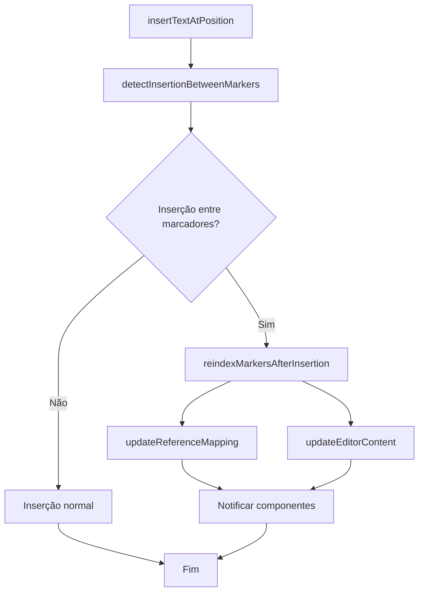

# Design Document

## Overview

Este documento detalha o design da solução para o sistema automático de reindexação de marcadores no editor BlockNote+TipTap. O sistema atual apresenta um problema crítico onde a inserção de texto entre marcadores existentes quebra a sequência numérica, causando falha nos grifos. A solução proposta implementa reindexação automática que preserva a integridade dos marcadores e mantém a funcionalidade dos grifos.

## Architecture

### Current System Analysis

O sistema atual funciona com os seguintes componentes principais:

1. **NotionLikePage.jsx**: Gerencia o `referenceMapping` (Map bidirecional título ↔ marcador)
2. **BlockNoteEditor.jsx**: Contém `insertTextAtPosition` que insere texto e gera novos marcadores
3. **textHelpers.js**: Funções `cleanText` e `mapCleanToOriginalIndex` para processamento de texto
4. **textInsertionHelpers.js**: `handleCanvasConnection` que coordena inserções via canvas

### Problem Identification

**Cenário Atual:**
```
Texto original [16] Texto original [17]
```

**Após inserção entre [16] e [17]:**
```
Texto original [16] Novo texto [18] Texto original [17]
```

**Problema:** O marcador [18] deveria ser [17], e o texto original [17] deveria ser reindexado para [18].

### Proposed Architecture

A solução implementa um sistema de reindexação automática com os seguintes componentes:



## Components and Interfaces

### 1. MarkerReindexingService

**Localização:** `src/utils/markerReindexingService.js`

**Responsabilidades:**
- Detectar inserções entre marcadores existentes
- Executar reindexação automática
- Atualizar conteúdo do editor
- Sincronizar referenceMapping

**Interface:**
```javascript
class MarkerReindexingService {
  // Detecta se inserção ocorreu entre marcadores
  static detectInsertionBetweenMarkers(editorContent, insertionPosition, newMarker)
  
  // Executa reindexação completa
  static reindexMarkersAfterInsertion(editorContent, insertionPosition, newMarker)
  
  // Atualiza referenceMapping com novos índices
  static updateReferenceMapping(oldMapping, reindexingMap)
  
  // Aplica mudanças no editor
  static applyReindexingToEditor(editor, newContent, reindexingMap)
}
```

### 2. Enhanced BlockNoteEditor

**Modificações em:** `src/components/advancedCanvas/BlockNoteEditor.jsx`

**Novas funcionalidades:**
- Integração com MarkerReindexingService
- Detecção automática de inserções entre marcadores
- Callback para notificar reindexação

**Interface atualizada:**
```javascript
// Método insertTextAtPosition aprimorado
insertTextAtPosition: async (searchText, newText, position, onReferenceUpdate, onReindexing) => {
  // 1. Inserção normal
  // 2. Detectar se precisa reindexar
  // 3. Executar reindexação se necessário
  // 4. Notificar mudanças
}
```

### 3. Enhanced NotionLikePage

**Modificações em:** `src/components/advancedCanvas/NotionLikePage.jsx`

**Novas funcionalidades:**
- Callback para receber notificações de reindexação
- Atualização automática do referenceMapping
- Logs detalhados do processo

**Interface atualizada:**
```javascript
// Novo callback para reindexação
const handleMarkerReindexing = useCallback((reindexingMap) => {
  // Atualizar referenceMapping
  // Registrar logs
  // Notificar outros componentes
}, []);
```

## Data Models

### 1. ReindexingMap

Estrutura que mapeia marcadores antigos para novos:

```javascript
{
  oldMarker: string,    // "[17]"
  newMarker: string,    // "[18]"
  title: string,        // "Título do conteúdo"
  position: number      // Posição no texto
}
```

### 2. InsertionContext

Contexto da inserção para determinar necessidade de reindexação:

```javascript
{
  insertionPosition: number,     // Posição onde texto foi inserido
  newMarker: string,            // Novo marcador gerado
  existingMarkers: Array,       // Marcadores existentes no texto
  needsReindexing: boolean,     // Se reindexação é necessária
  affectedRange: {              // Range de marcadores afetados
    start: number,
    end: number
  }
}
```

### 3. EditorState

Estado do editor durante reindexação:

```javascript
{
  originalContent: string,      // Conteúdo antes da reindexação
  newContent: string,          // Conteúdo após reindexação
  cursorPosition: number,      // Posição do cursor
  reindexingMap: Array,        // Mapa de reindexação
  timestamp: number            // Timestamp da operação
}
```

## Error Handling

### 1. Detecção de Erros

**Cenários de erro:**
- Falha na detecção de marcadores
- Erro na reindexação
- Falha na atualização do editor
- Inconsistência no referenceMapping

**Estratégia:**
```javascript
try {
  // Operação de reindexação
} catch (error) {
  // Reverter para estado anterior
  // Registrar erro detalhado
  // Notificar usuário se necessário
  // Manter funcionalidade básica
}
```

### 2. Rollback Strategy

**Implementação:**
- Backup do estado antes da reindexação
- Função de rollback automático em caso de erro
- Preservação do referenceMapping original
- Restauração da posição do cursor

### 3. Validation

**Validações implementadas:**
- Verificar integridade dos marcadores após reindexação
- Validar correspondência no referenceMapping
- Confirmar que todos os grifos ainda funcionam
- Verificar se não há marcadores duplicados

## Testing Strategy

### 1. Unit Tests

**MarkerReindexingService:**
```javascript
describe('MarkerReindexingService', () => {
  test('detecta inserção entre marcadores corretamente')
  test('reindexação preserva ordem sequencial')
  test('atualiza referenceMapping corretamente')
  test('trata casos edge (primeiro/último marcador)')
})
```

**BlockNoteEditor Integration:**
```javascript
describe('BlockNoteEditor reindexing', () => {
  test('inserção entre marcadores dispara reindexação')
  test('inserção no início/fim não dispara reindexação')
  test('múltiplas inserções são processadas corretamente')
  test('erro na reindexação não quebra editor')
})
```

### 2. Integration Tests

**Sistema completo:**
```javascript
describe('Sistema de reindexação completo', () => {
  test('inserção via canvas dispara reindexação')
  test('grifos continuam funcionando após reindexação')
  test('referenceMapping permanece sincronizado')
  test('performance não é impactada significativamente')
})
```

### 3. E2E Tests

**Cenários de usuário:**
- Inserir texto entre marcadores via drag & drop
- Verificar que grifos continuam funcionando
- Inserir múltiplos textos em sequência
- Testar com documentos grandes (100+ marcadores)

## Performance Considerations

### 1. Otimizações

**Detecção eficiente:**
- Cache de posições de marcadores
- Busca binária para encontrar posição de inserção
- Processamento apenas da região afetada

**Reindexação otimizada:**
- Reindexar apenas marcadores necessários
- Batch updates no editor
- Debounce para múltiplas inserções rápidas

### 2. Memory Management

**Estratégias:**
- Cleanup de estados temporários
- Garbage collection de mappings antigos
- Limite de histórico de operações

### 3. Benchmarks

**Métricas alvo:**
- Detecção: < 10ms
- Reindexação: < 100ms para 50 marcadores
- Atualização do editor: < 200ms
- Memória adicional: < 5MB

## Implementation Phases

### Phase 1: Core Service (Semana 1)
- Implementar MarkerReindexingService
- Testes unitários básicos
- Integração com textHelpers.js

### Phase 2: Editor Integration (Semana 2)
- Modificar insertTextAtPosition
- Implementar detecção automática
- Testes de integração

### Phase 3: UI Integration (Semana 3)
- Integrar com NotionLikePage
- Implementar callbacks de notificação
- Testes E2E básicos

### Phase 4: Polish & Optimization (Semana 4)
- Otimizações de performance
- Error handling robusto
- Documentação completa
- Testes de stress

## Monitoring and Logging

### 1. Logging Strategy

**Níveis de log:**
```javascript
// DEBUG: Operações detalhadas
console.log('🔍 Detectando inserção entre marcadores...')

// INFO: Operações principais
console.log('✅ Reindexação concluída: 5 marcadores atualizados')

// WARN: Situações não críticas
console.warn('⚠️ Reindexação demorou mais que esperado: 250ms')

// ERROR: Erros que precisam atenção
console.error('❌ Falha na reindexação, revertendo estado')
```

### 2. Metrics

**Métricas coletadas:**
- Tempo de execução da reindexação
- Número de marcadores reindexados
- Frequência de inserções entre marcadores
- Taxa de erro na reindexação

### 3. Debug Tools

**Ferramentas de debug:**
- Visualizador do referenceMapping
- Timeline de operações de reindexação
- Comparador de estado antes/depois
- Simulador de inserções para teste